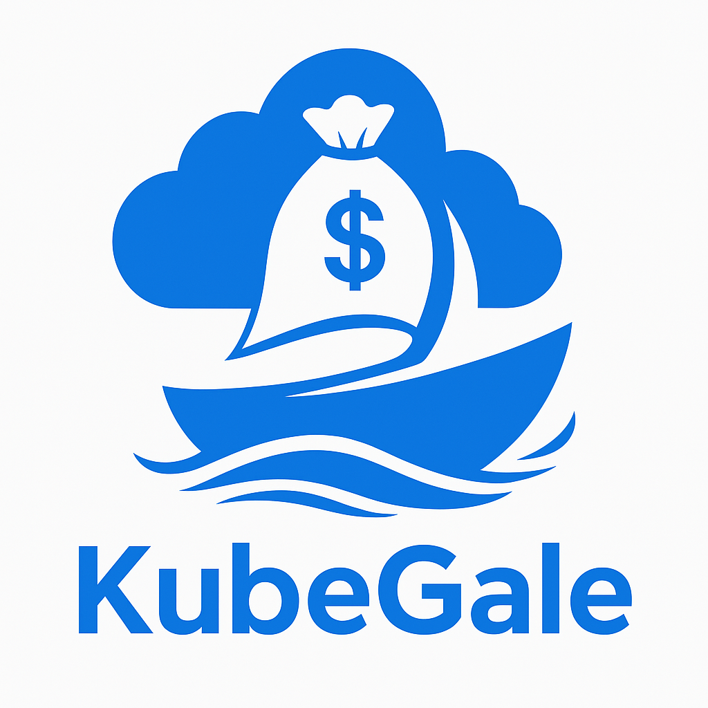

# KubeGale

<div align="center">
  
  <p>强大的 Kubernetes 多集群管理平台</p>
</div>

<p align="center">
  <a href="https://golang.google.cn/">
    
  </a>
  <a href="https://gin-gonic.com/">
    
  </a>
  <a href="https://gorm.io/">
    
  </a>
  <a href="https://redis.io/">
    
  </a>
  <a href="https://vuejs.org/">
    
  </a>
  <a href="https://element-plus.org/zh-CN/">
    
  </a>
</p>

## 项目简介

KubeGale 是一个基于 Go + Vue 开发的 Kubernetes 多集群管理平台，集成了 CMDB 资产管理、容器平台、CICD 功能等。本项目后端使用 Go、Gin、Gorm 开发，前端使用 Vue3 + Element Plus 框架。

## 功能特点

- 🚀 **多集群管理**：统一管理多个 Kubernetes 集群
- 📊 **资源可视化**：直观展示集群资源使用情况
- 🔐 **权限控制**：细粒度的用户权限管理
- 🔄 **CI/CD 集成**：支持自动化部署流程
- 📝 **CMDB 资产管理**：全面的 IT 资产管理
- 🌐 **容器平台**：简化容器应用的部署和管理

## 快速开始

### 环境要求

- Go 1.23+
- MySQL 5.7+
- Redis 5.0+
- Node.js 14+

### 后端部署

1. 克隆仓库

```bash
git clone https://github.com/daihao4371/KubeGale.git
cd KubeGale
```
2. 安装依赖
```bash
go mod tidy
```
3. 配置数据库
在 `config.yaml` 文件中配置数据库连接信息。
4. 运行后端
```bash
go run main.go
```


| 文件夹       | 说明                    | 描述                        |
| ------------ | ----------------------- | --------------------------- |
| `api`        | api层                   | api层 |
| `--v1`       | v1版本接口              | v1版本接口                  |
| `config`     | 配置包                  | config.yaml对应的配置结构体 |
| `core`       | 核心文件                | 核心组件(zap, viper, server)的初始化 |
| `docs`       | swagger文档目录         | swagger文档目录 |
| `global`     | 全局对象                | 全局对象 |
| `initialize` | 初始化 | router,redis,gorm,validator, timer的初始化 |
| `--internal` | 初始化内部函数 | gorm 的 longger 自定义,在此文件夹的函数只能由 `initialize` 层进行调用 |
| `middleware` | 中间件层 | 用于存放 `gin` 中间件代码 |
| `model`      | 模型层                  | 模型对应数据表              |
| `--request`  | 入参结构体              | 接收前端发送到后端的数据。  |
| `--response` | 出参结构体              | 返回给前端的数据结构体      |
| `router`     | 路由层                  | 路由层 |
| `service`    | service层               | 存放业务逻辑问题 |
| `source` | source层 | 存放初始化数据的函数 |
| `utils`      | 工具包                  | 工具函数封装            |
| `--timer` | timer | 定时器接口封装 |

## 开发指南
### 添加新功能
1. 在 model 目录下创建数据模型
2. 在 service 目录下实现业务逻辑
3. 在 api 目录下创建接口处理函数
4. 在 router 目录下注册路由
### 代码规范
- 遵循 Go 官方推荐的代码规范
- 使用 gofmt 格式化代码
- 添加适当的注释和文档
## 贡献指南
1. Fork 本仓库
2. 创建您的特性分支 ( git checkout -b feature/amazing-feature )
3. 提交您的更改 ( git commit -m 'Add some amazing feature' )
4. 推送到分支 ( git push origin feature/amazing-feature )
5. 打开一个 Pull Request
## 相关项目
- KubeGale-web 
- [前端服务地址](https://github.com/daihao4371/KubeGale-web.git)
- [开发设计文档](https://c057jlmw2q.feishu.cn/wiki/X1gQwMh2OicpYSk4XN1caH2Dntc?fromTtSwitch=1)

## 许可证
本项目采用 MIT 许可证 。


## 联系我们
如果您有任何问题或建议，请随时联系我们。
邮箱: daihao5887@gamil.com
